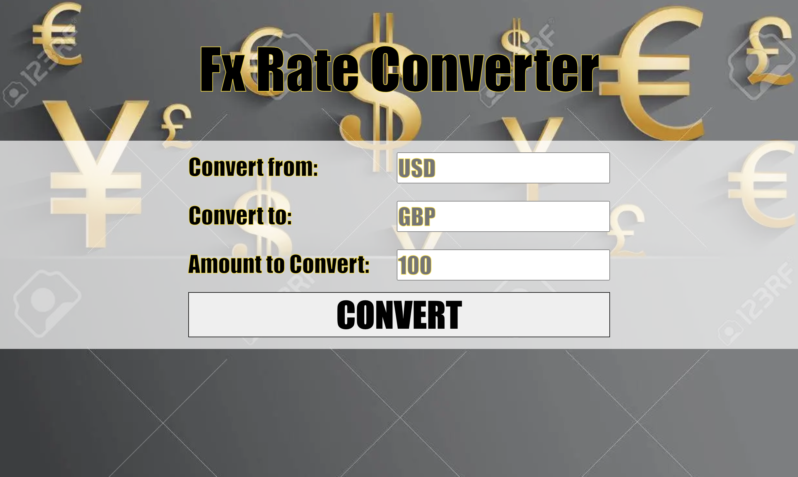

# Flask Foreign Currency Converter

## 🧐 Project Description

A simple currency converter using the forex-python module. By specifying the currency to convert from, the currency to convert to, and the amount to convert, this converter will tell you the input amount in the desired currency's amount. 
